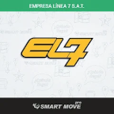
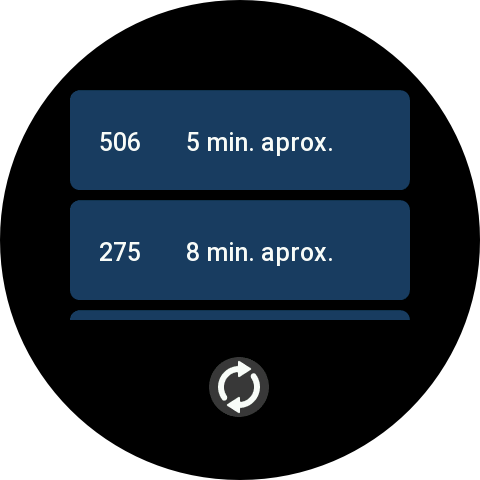
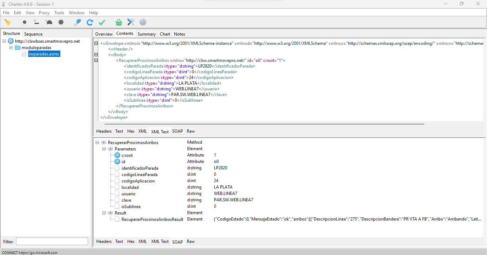

 
  

#

Este es un proyecto para uso personal que lo que busca es poder acceder a los horarios de los micros para ciertas paradas de la linea mediante mi reloj Amazfit GTR3 sin tener que usar mi telefono.

En el directorio llamado "App" se encuentra la aplicacion para el reloj y en el directorio llamado "server" se encuentra el servidor necesario para usar esta aplicacion.

# Aplicacion del reloj

Gracias a la [documentacion de ZeppOS](https://docs.zepp.com/docs/intro/) es muy facil hacer una aplicacion para un reloj de Amazfit que use este sistema operativo.

La aplicacion que hice en este caso tiene una interfaz muy simple y solo esta hecha para 2 paradas de micro en particular ya que son las unicas que necesitaba aunque se podria hacer una interfaz mas compleja y tener acceso a todas las paradas como en la aplicacion original.

La aplicacion utiliza el API de [mensajes](https://docs.zepp.com/docs/reference/side-service-api/messaging/?_highlight=message) para comunicarse con el "Side Service" que es una parte de la aplicacion que corre en la aplicacion [Zepp](https://play.google.com/store/apps/details?id=com.huami.watch.hmwatchmanager&hl=es_AR&gl=US) en el telefono con la cual nos podemos comunicar cuando el reloj esta conectado al telefono por bluetooth, gracias a esto la aplicacion del reloj solo se encarga de enviar mensajes al Side Service el cual usando el API fetch realiza un POST al endpoint de la aplicacion original y retorna todos los micros que estan por llegar para una parada especifica dependiendo del boton que se presione.

# Server

Este server esta hecho con [Node Js](https://nodejs.org/en) usando [Express](https://www.npmjs.com/package/express).

Para saber cual era el endpoint de la aplicacion original tuve que usar [Charles proxy](https://www.charlesproxy.com/) lo que me permitio ver las requests que realizaba mi telefono conectandolo a un proxy creado con dicho software.

Luego de conectarme al proxy al buscar los micros que estan por venir puedo ver en Charles proxy lo que esta haciendo la aplicacion, entonces teniendo esto ya se que tengo que hacer un POST a ese endpoint con ese XML.

Al realizar esta request a este endpoint retorna un xml que contiene los parametros y el resultado de mi request, usando [xml2js](https://www.npmjs.com/package/xml2js) puedo "parsear" el xml que me retornado para poder extraer la lista de micros del resultado y retornarla a la aplicacion del reloj mediante los mensajes previamente mencionados.
